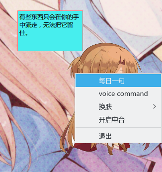
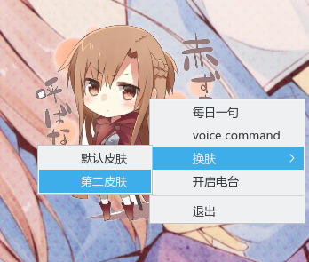
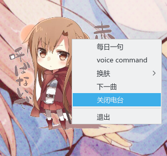
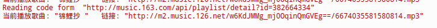
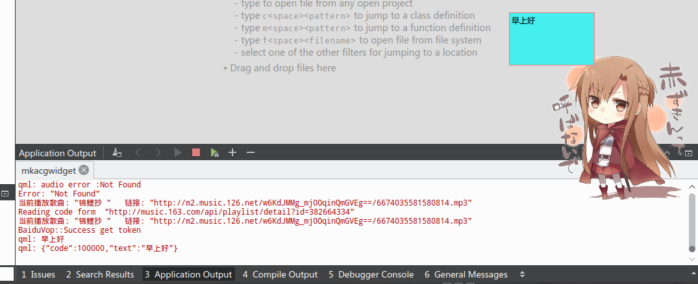
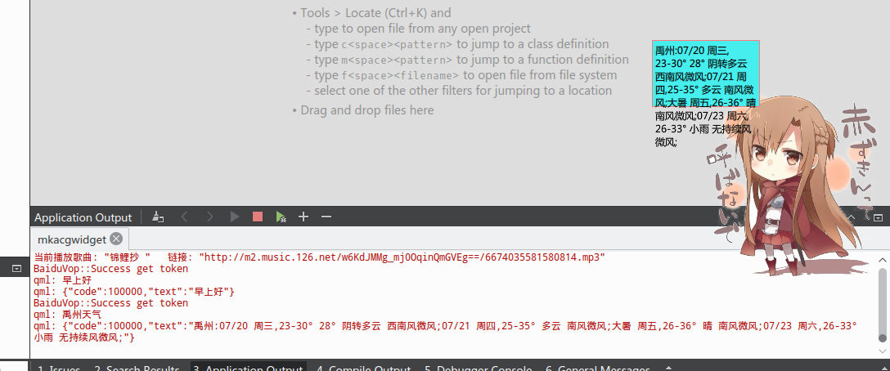

# mkacgwidget
该项目是使用qt在linux下应用，需要使用Deepin　Desktop Environment.
程序架构为

```
—————————
         |——核心
         |——功能
         |—|—Dbus（电量）（语音）
         |—|—模块（对话）（一言）（邮件）（IRC）（语音）（动作）
         |——界面
         |—|——（仿live2d的SSP）（SAO血两条）（mailBox）（IRC聊天室）
```

运行示例




主题做的不怎么好，只是简单的替换文件。





歌曲现在出现问题了，网易云音乐似乎封了几个url，老的API估计没办法用了，有空换新的。



语音操作已经做了一半了，不知道如何控制录音长度，所以暂时只能录音五秒进行对话。



这里还没做好，内容会超出。


